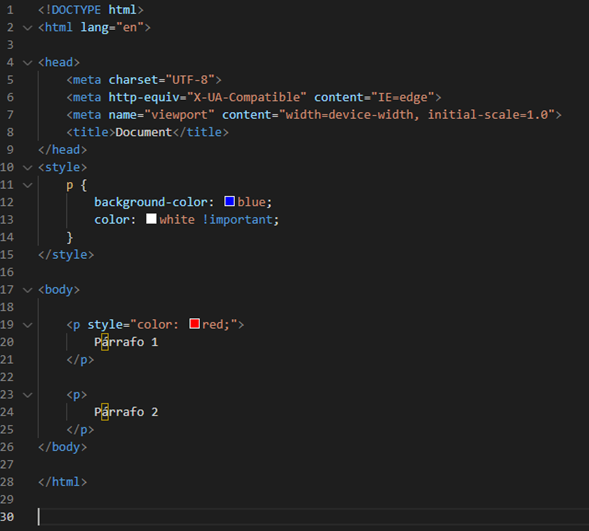
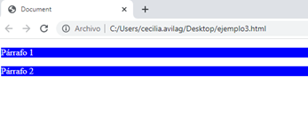
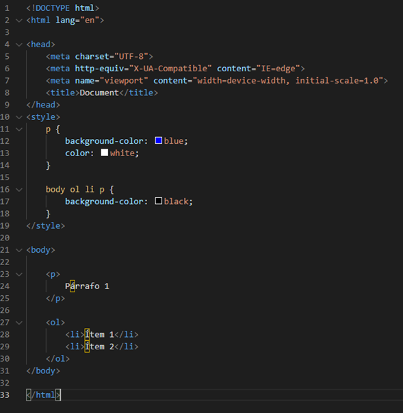
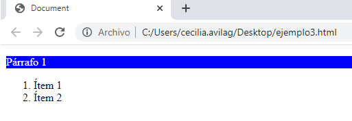
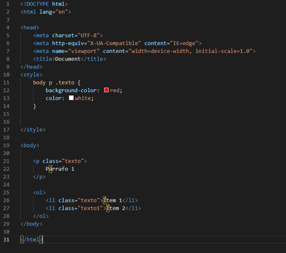
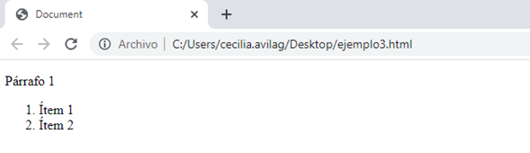

# Respuesta del quiz

1. De acuerdo con el siguiente código: 

    #### La respuesta es: b.
    

    ¿por qué? Porque el !important cuando se aplica a la propiedad de color, como dice su nombre, es más importante, que la propiedad en linea que se le coloca al primer p. Por lo cual todos los p tendrán background-color: blue y color: white.

2. De acuerdo con el siguiente código:

    #### La respuesta es: b.

    

    ¿por qué? para la etiqueta p solamente aplica el background-color: blue, porque el color: white. La otra propiedad se aplica a todas las etiquetas p que estén dentro de un li y también dentro de un ol dentro de un body. Como no hay ninguna etiqueta p que cumpla con esas condiciones, no se aplica la propiedad background-color: black;

3. De acuerdo con el siguiente código:

    #### La respuesta es: a.

    

    ¿por qué? En la regla de body p .texto solo se aplican a los elementos que estén dentro de una etiqueta p y que estén dentro de un body. Como no hay ninguna etiqueta p que cumpla con esas condiciones, no se aplica la propiedad background-color: black;

